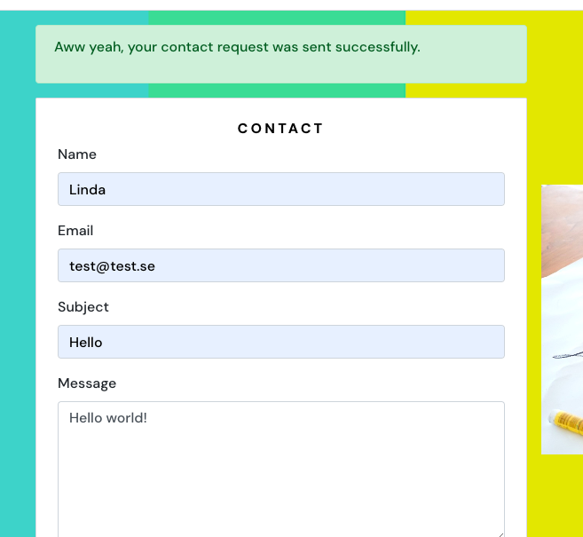

# Playdate

Playdate is an application designed to simplify the process of arranging playdates for parents. As any parent knows, it can often take hours or even days to coordinate schedules and respond to text messages amidst the chaos of daily life. This app aims to alleviate the challenges associated with scheduling playdates, making it easier for parents to connect and organize opportunities for their children to socialize and play together.

Link to live site:
[Link to playdate](https://playdate-184e33ed70de.herokuapp.com/)
Link to API:
[Link to drf-api](https://playdate-drf-api-a577c80fbeb8.herokuapp.com/)

## Project Goals

The goal for Playdate was to create an easy-to-navigate site where parents can arrange playdates for their kids. The step between wanting someone to play with and actually arranging the playdate is hopefully much smaller with this site in mind.

## Agile Methodology

Agile Methodology was used to help prioritize and organize tasks for the hole webpage. I used Project Boards on Github.

* Epics were written containing possible user stories and based on that the website was made.
* User stories were created by looking at epics and added on as the project was advancing.
* Project Board was used to track progression of the task through the Todo, In progress and Done columns

 Userstories / Project board

To see the Epic and user stroies in full: [Project Board](https://github.com/users/LindaAPersson/projects/9).

## User Experience

### User Stories
#### First time user
As a first-time user of Playdate, I have specific expectations regarding the website's usability and functionality. Firstly, I want the website to offer intuitive navigation, allowing me to easily explore different sections and quickly locate information about playdates. Clear and organized menus, along with prominent search and filter functionalities, 

#### Registred user
As a registered user of Playdate, I desire the capability to organize playdates, leave comments and review past playdates. This functionality enables me to actively engage with the content and enhance the community's enjoyment. Additionally, I seek the ability to edit or delete my playdates, comments, and reviews, empowering me to maintain control over my contributions and ensure their accuracy and relevance.

#### None registred user
As a non-registered user, I anticipate the ability to access and browse all playdates, comments, and reviews available on the Playdate platform. This includes having unrestricted access to view upcoming playdates, read comments left by other users, and peruse reviews of past events. Additionally, I expect the functionality to filter and search for playdates.

### Design
I envision Playdate as a cheerful platform that evokes a positive, childlike atmosphere, enriching the user experience with its playful design elements. To achieve this, I propose incorporating an abundance of bright and cheerful colors throughout the website's interface. These colors should reflect the joy and excitement associated with childhood, creating an inviting and engaging environment for users.

Furthermore, the site's layout should be carefully structured to prioritize clarity and readability. Playdates should be presented on a clean, white background to ensure that the information is easily legible and accessible to users.

#### Color
The color scheme for this application was inspired by childhood. I wanted a lot of happy colors to reflect the site's purpose – to bring children together to play, explore, and create memories.

#### Wireframes
While planning this site, I sat down with pen and paper and sketched out the outlines of how I wanted the site to be. Since then, the structure and the number of pages have changed. However, the essence of what I drew is still there.

#### Fonts
Google Fonts were implemented on the website. Latin with sans-serif as fallback was used thoughout the site to ensure high legibility of the content.

## Features

### Existing Features

An easy-to-navigate navbar that changes icons/features depending on whether the user is signed in or not.

 Navbar

 

On the entire page, the messages 'signed in as: ...' are visible when the user are signed in, so the user always knows if they are signed in or not.

 Signed in as

 

All playdates are displayed with an image at the top to create a more lively page. All the information on the playdate is placed below the image in a very structured format.

 Playdate

 

Under the 'My Playdates' tag, a logged-in user can find all their own playdates.

 My Playdate

 

Create a playdate: a logged-in user can access the create form through the 'add playdate' option in the navbar. Each playdate can hold an image. If the user doesn't want to add their own image, they can select a default image provided by the site.

Edit a playdate: a logged-in user can edit their own playdate. When they access the edit form (through the three dots at the bottom of a playdate), the form is prepopulated with the information already added.

 Create and Edit playdate

 

Not logged-in users can read all comments and reviews. But they need to sign in to be able to leave both comments and reviews. To make the comments and reviews easier to navigate, I put them in a 'collapsible' format so that one hides when the other one is displayed. The review option only appears on playdates that have already occurred.

 Comment and review

 

At the moment, there are two different ways to filter the playdates. The first one is through the search bar. If the user types in the search bar, the playdates that match the text (if there are any) will be displayed. The second one is a date filter. The user can select a start date and press the filter button, then all the playdates from that date will appear. The user can also select only an end date and then press the filter button, and all playdates up until that date will appear. Alternatively, the user can select both a start and end date, and press the filter button, then all playdates between those dates will appear. After the desired date search, the user needs to click the 'clear date' button to display all the playdates again.

 Filters 

 

The sign-in page is easy to navigate to through the navbar if the user is not signed in. If the user is not signed in, the navbar won't show the sign-in option (if a signed-in user adds 'signin' in the URL, they will be rerouted to the home page). The sign-in page is easy to understand with one field for a username and one field for the password.

 Sign in

 

The sign-up page is easy to navigate to through the navbar if the user is not signed in. If the user is not signed in, the navbar won't show the sign-up option (if a signed-in user adds 'signup' in the URL, they will be rerouted to the home page). The sign-up page is easy to understand with fields for username, creating passwords, and confirming passwords.

 Sign up

 

The logout option only appears in the navbar for logged-in users. If they press the button, they are automatically signed out, and a success message appears as they get rerouted to the homepage.

 Log out

 

All users can fill out a contact form and send it to the organizers of the page. If the message is sent successfully, a success message will appear.

 Contact

 

There is a custom 'page not found' message displaying when the user enters an invalid URL.

 Page not found

### Future Features

* One of the exciting future features I envision for the platform is the implementation of a dynamic calendar (where the pink image of a calendar is placed now on desktop view). By clicking on a particular date within the calendar, users would be able to instantly view all relevant playdates scheduled for that day. The calendar feature would enhance the overall user experience by offering a comprehensive overview of upcoming activities. Whether planning ahead for the week or seeking last-minute opportunities to connect with other families, the calendar provides a valuable tool for facilitating social engagement and community interaction on the platform.

## Technologies Used

### Languages
* HTML
* CSS
* Javascript
    - React

### Libraries, frameworks and dependencies
* Axios - axios were used for promise-based HTTP. 
* JWT - library to decode out JSON Web token. 
* React 17 - JavaScript library for building user interfaces
* React-Bootstrap 4.6 
* React Infinite Scroll 
* React Router - used for dynamic routing. 

### Tools & Programs
* Am I Responsive was used to create the multi-device mock-up at the top of this README.md file
* Chrome dev tools was used for debugging of the code and checking site for responsiveness
* Cloudinary to store static files
* Favicon.io for making the site favicon
* Font Awesome - Icons from Font Awesome were used throughout the site
* Google Fonts 
* Git was used for version control within VSCode to push the code to GitHub
* GitHub was used as a remote repository to store project code
* Gitpod was used to host a virtual workspace
* Heroku Platform was used to deploy the project into live environment

### Validation:
* Jigsaw W3 Validator was used to validate the css
* ESLint used to validate JSX code
* Lighthouse used to validate performance, accessibility, best practice and SEO of the app
* Wave - used to evaluate application accessibility

See all the results in [TESTING.md](TESTING.md)

## Testing
Please see  [TESTING.md](TESTING.md) for all the detailed testing performed.

## Back-end

Please see [API README.md](https://github.com/LindaAPersson/playdate_drf_api/blob/main/README.md) for a full overview of the back-end connected to playdate. 

Please see [API TESTING.md](https://github.com/LindaAPersson/playdate_drf_api/blob/main/TESTING.md) for a full overview of the back-end testing connected to playdate. 

## Deployment
First, I created a new repository on GitHub with the following steps:

1. Log into GitHub.
2. Go to repository and click on 'New'.
3. Choose a repository name and create the repository.
4. Click the Gitpod button to open the new repository in GitPod.

The development environment used for this project was GitPod.

5. Once the IDE has loaded, run the terminal command npx create-react-app . --use-npm to install React.
6. After it has finished installing run the command npm start to check the app is working.
7. Git add, commit and push changes to GitHub.

The project was deployed using Heroku, following these steps:

1. Login to Heroku (Create an account if necessary).
2. Click on "New" in the Heroku dashboard and select "Create new app."
3. Write a name for the app, choose your region, and click "Create App."
4. In the deployment tab, select GitHub as the deployment method and confirm your choice.
5. In the "Connect to GitHub" field, search for your repository name and click on the connect button next to the right repository.
6. Choose between automatic deploys or manual deploys. I chose automatic deploys.
7. When the app is deployed, a link will appear at the bottom of the page.

## Credit
* A lot of inspiration was taken from Code Institute's walk-through project moments. That project was instrumental in helping me get started and provided a solid foundation for my own project.
* To set up a default image in the create playdate and edit playdate, this article helped me understand how to arrange the proper file format. [Article](https://stackoverflow.com/questions/73945065/convert-image-from-url-to-file)
* Tutor support at Code Institute helped me with the date filter feature. To get that line right wouldn't have taken me a year by myself!
* My mentor Laure-Nicole deserves the most credit for keeping me on track and helping me plan the project so it actually would be manageable within my short timeframe."
* The images used throughout the project are from [Pixabay](https://pixabay.com/)