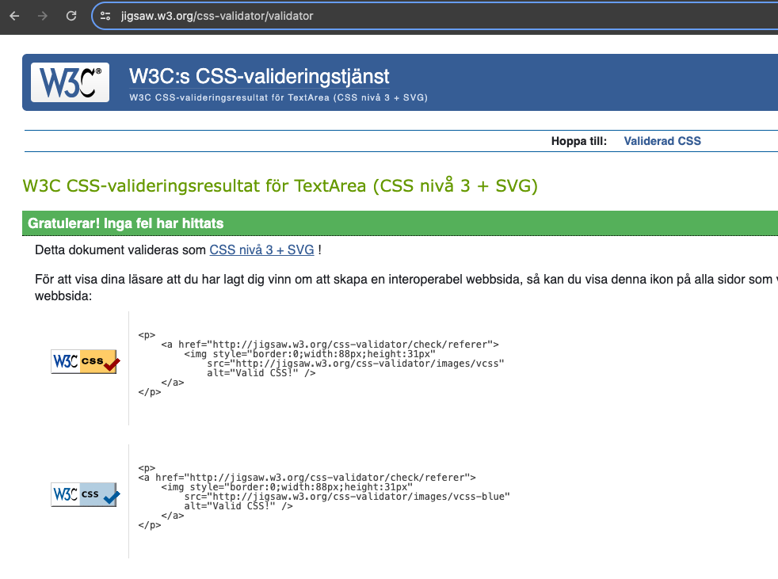
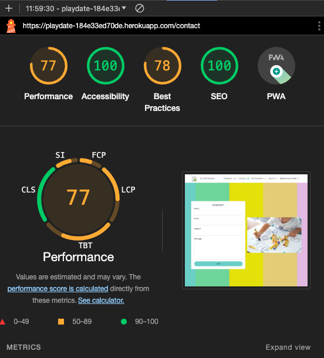

# Playdate

This file only contains the exstensive testing done to the webpage. All other information regarding the site will be found in [README](README.md).

## Responsvie Testing 
The deployed website was tested to ensure its responsiveness and adaptability. Developer Tools were used during development to see how the website behaves across different devices. react-bootstrapt were implemented to achieve the desired design, ensuring that the website maintains its visual and functional integrity on all platforms, enhancing the user experience.

Here are screenshots of the responsive design, both as login and not loged in. 

 Desktop/Laptop

 Tablet

 Mobile

## Browser and device Compatibility Testing
The webpage was tested on different webbrowsers to ensur a good experience for the users. The webpage was tested on following browsers and devices:

 Safari

 Google chrome

 Iphone

 Samsung galaxy s22

## Code Validation

### CSS

 App.module.css

 Asset.module.css

 Button.module.css

 Comment.module.css

 CommentCreateEditForm.module.css

 index.css

 MoreDropdown.module.css

 NavBar.module.css

 NotFound.module.css

 Playdate.module.css

 PlaydateCreateEditForm.module.css

 PlaydatesPage.module.css

 Review.module.css

 ReviewCreateEditForm.module.css

 SignInUpForm.module.css

### ESLint

 ESLint

## Lighthouse Report

Under every category, there are two screenshots provided: one tailored for desktop viewing and another optimized for mobile devices. 

 Home

Desktop

Mobile

 Contact

Desktop

Mobile

 My playdates

Desktop

Mobile

 Add Playdate

Desktop

Mobile

 Edit Playdate

Desktop

Mobile

 Comments / Reviews

Desktop

Mobile

 Sign in

Desktop

Mobile

 Sign up

Desktop

Mobile

The performance score for the website is affected by third-party cookies. But I don't have the knowledge to fix the issue. 

## WAVE

 Home

 Contact

 My playdates

 Add Playdate

Add Playdate with no errors:

Add Playdate code with no errors:

Add Playdate with errors:

Add Playdate code with errors:

 Edit Playdate

Edit Playdate with no errors:

Edit Playdate code with no errors:

Edit Playdate with errors:

Edit Playdate code with errors:

 Comments / Reviews

 Sign in

 Sign up

Desktop

## Feature Testing

| Page          | User Action   | Expected Result  | Notes            |
|---------------|---------------|------------------|------------------|
| Navbar        |               |                  |                  |
|               | Click on Logo | Redirect to Home Page | PASS        |
|               | Click on Sign Up button | Redirect to login page | PASS |
|               | Click on sign up | Redirect to register page | PASS |
|               | Click on Contact | Redirect to contact page | PASS |
|               | Click on my playdates | Redirect to my pladates page | PASS |
|               | Click on add playdate | Redirect to add playdate page | PASS |
| Navbar (Logged In - User)  |                 |          |  |
|               | After Login | Sign Up button is now logout button | PASS |
|               | After Login | Register button hides | PASS |
|               | After Login | Users name is displayed | PASS |
| Contact Page  |                 |          |  |
|               | Enter info in cantact form | contact form info sends | PASS |
|               | Sends a cantact form | Succes message shows | PASS |
| Sign Up Page  |                  |                  |                  |
|               | Type invalid username | Error message with more info | PASS |
|               | Type valid username | No error | PASS |
|               | Type invalid password | Must contain atleast 8 char | PASS |
|               | Type valid password | No error | PASS |
|               | Type password again (different) | Password must be the same | PASS |
|               | Click Sign Up with empty form | This field may not be blank | PASS |
|               | Click Sign In if you have an account | Redirect to Login page | PASS |
|               | Fill all the form fields | Account created send to sign in page | PASS |
| Sign in Page  |                  |                  |                  |
|               | Click on Sign Up, if you don't have an account | Redirect to Sign Up page | PASS |
|               | Try invalid username | Unable to log in with provided credentials | PASS |
|               | Try invalid password | Unable to log in with provided credentials | PASS |
|               | Valid password and username | Signs in, redirect to home page  | PASS |
|               | Click Sign In with empty form | This field may not be blank | PASS |
| Log out  |                  |                  |                  |
|               | Click on Log Out button | Sign user out, succses message, redirect to home page | PASS |
| NotFound Page |  |    |    |
|               | Type in URL that does not exists | Custom NotFoud page is displayed | PASS |
| Playdate Page  |                  |                  |                  |
|               | Click on date filter | Filter playdates by date | PASS |
|               | Write in searchbar | Filter playdates by text | PASS |
|               | Read all playdates | Working as expected | PASS |
|               | Filter playdates on dates | Working as expected | PASS |
|               | Filter jokes on text (in searchbar) | Working as expected | PASS |
|               | Click on comments symbol | Comments display | PASS |
|               | Click on review symbol | reviews display | PASS |
| Playdate Page (logged in - user)  |                  |                  |                  |
|               | Add a Playdate | Playdate i created  | PASS |
|               | Click on edit on their own playdate | Edit form display  | PASS |
|               | Click on delet on their own playdate | Playdate deleted  | PASS |
|               | Filter playdates on dates | Working as expected | PASS |
|               | Filter jokes on text (in searchbar) | Working as expected | PASS |
|               | Click on comments symbol | Comments display | PASS |
|               | Click on review symbol | reviews display | PASS |
|               | Leave a comment | Working as expected | PASS |
|               | Click on edit on their own comment | Working as expected | PASS |
|               | Click on delet on their own comment | Comment deleted  | PASS |
|               | Leave a review | Working as expected | PASS |
|               | Click on edit on their own review | Working as expected | PASS |
|               | Click on delet on their own rewview| Review deleted  | PASS |
| My playdate (only for logged in user)  |                  |                  |                  |
|               | See all my playdates | Working as expected | PASS |

## Bugs
### Resolved bugs

### Unresolved bugs
* I've encountered a persistent issue that appears in DevTools, which I've been unable to resolve. The problem involves rendering cookies in a cross-site context. Despite numerous attempts to address the issue through troubleshooting and debugging, the root cause remains elusive. Further investigation and collaboration may be necessary to pinpoint and resolve this challenging bug.

* While it's not technically a bug in the code, I'm encountering issues with the loading time of images, which is negatively impacting the performance of the site, as indicated by Lighthouse reports. Unfortunately, I don't have the time to learn how to fix the issue. However, further investigation and optimization strategies are needed to improve image loading performance and overall site performance metrics.