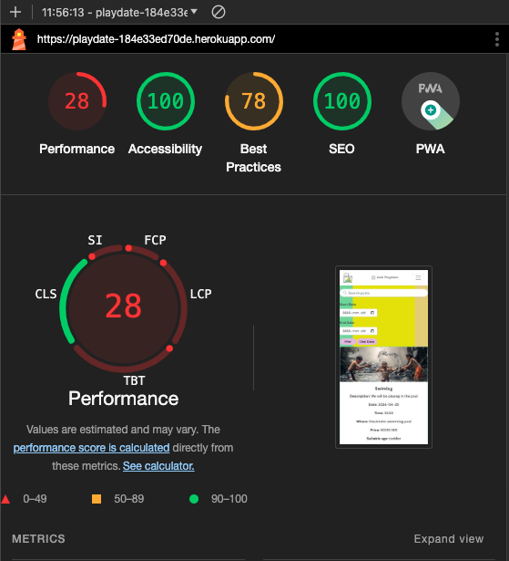

# Playdate

This file only contains the exstensive testing done to the webpage. All other information regarding the site will be found in [README](README.md).

## Responsvie Testing 
The deployed website was tested to ensure its responsiveness and adaptability. Developer Tools were used during development to see how the website behaves across different devices. react-bootstrapt were implemented to achieve the desired design, ensuring that the website maintains its visual and functional integrity on all platforms, enhancing the user experience.

Here are screenshots of the responsive design, both as login and not loged in. 

 Desktop/Laptop

 Tablet

 Mobile

## Browser and device Compatibility Testing
The webpage was tested on different webbrowsers to ensur a good experience for the users. The webpage was tested on following browsers and devices:

 Safari

 Google chrome

 Iphone

 Samsung galaxy s22

## Code Validation

### CSS

 App.module.css

 Asset.module.css

 Button.module.css

 Comment.module.css

 CommentCreateEditForm.module.css

 index.css

 MoreDropdown.module.css

 NavBar.module.css

 NotFound.module.css

 Playdate.module.css

 PlaydateCreateEditForm.module.css

 PlaydatesPage.module.css

 Review.module.css

 ReviewCreateEditForm.module.css

 SignInUpForm.module.css

### ESLint

 ESLint

## Lighthouse Report

Under every category, there are two screenshots provided: one tailored for desktop viewing and another optimized for mobile devices. 

 Home

Desktop

Mobile

 Contact

Desktop

Mobile

 My playdates

Desktop

Mobile

 Add Playdate

Desktop

Mobile

 Edit Playdate

Desktop

Mobile

 Comments / Reviews

Desktop

Mobile

 Sign in

Desktop

Mobile

 Sign up

Desktop

Mobile

The performance score for the website is affected by third-party cookies. But I don't have the knowledge to fix the issue. 

## WAVE

 Home

 Contact

 My playdates

 Add Playdate

Add Playdate with no errors:

Add Playdate code with no errors:

Add Playdate with errors:

Add Playdate code with errors:

 Edit Playdate

Edit Playdate with no errors:

Edit Playdate code with no errors:

Edit Playdate with errors:

Edit Playdate code with errors:

 Comments / Reviews

 Sign in

 Sign up

Desktop

## Feature Testing

| Page          | User Action   | Expected Result  | Notes            |
|---------------|---------------|------------------|------------------|
| Home Page     |               |                  |                  |
|               | Click on Logo | Redirect to Home Page | PASS        |
|               | Click on Sign Up button | Redirect to login page | PASS |
|               | Click on logout | Redirect to logout page | PASS |
|               | Click on register | Redirect to register page | PASS |
|               | Click on Contact | Move to contact page | PASS |
|               | Click on jokes | Redirect to jokes page | PASS |
|               | Click on jokes link in card | Redirect to jokes page | PASS |
|               | Click on links in footer | Redirect to socalmedia platforms | PASS |
| Home Page (Logged In - User)  |                 |          |  |
|               | After Login | Sign Up button is now logout button | PASS |
|               | After Login | Register button hides | PASS |
|               | After Login | Users name is displayed | PASS |
| Contact Page  |                 |          |  |
|               | Enter info in cantact form | contact form info sends to adminpanel | PASS |
| Sign Up Page  |                  |                  |                  |
|               | Enter invalid email | Field will only accept email address format | PASS |
|               | Enter valid email | No error | PASS |
|               | Email field left empty | Email is optional | PASS |
|               | Type invalid password | Must contain atleast 8 char | PASS |
|               | Type valid password | No error | PASS |
|               | Type password again (different) | Password must be the same | PASS |
|               | Click Sign Up with empty form | Fill in the form fields | PASS |
|               | Click Sign In if you have an account | Redirect to Login page | PASS |
|               | Fill all the form fields | Account created, alert message that you Signed in | PASS |
| Login Page  |                  |                  |                  |
|               | Click on Sign Up, if you don't have an account | Redirect to Sign Up page | PASS |
|               | Try invalid username | Username is not correct | PASS |
|               | Try invalid password | Password is not correct | PASS |
|               | Valid password and username | Logs in, message that you signed in | PASS |
|               | Click Sign In with empty form | Fill in the form fields | PASS |
| Logout Page  |                  |                  |                  |
|               | Click on Sign Out button | Sign user out, message that user signed out | PASS |
| 404 Error Page |  |    |    |
|               | Type in URL that does not exists | Custom 404 Error page is displayed | PASS |
|               | Click on Take Me Home button | Redirect to Home page | PASS |
| 500 Error Page |  |    |    |
|               | Admin raise exception in views.py | Custom 500 Error page is displayed, local development testing | PASS |
|               | Click on Go to Homepage button | Redirect to Home page | PASS |
| Admin Panel |  |    |    |
|               | CRUD functionality | Working as expected | PASS |
| Jokes Page  |                  |                  |                  |
|               | Read all jokes | Working as expected | PASS |
|               | Filter jokes on category | Working as expected | PASS |
|               | Filter jokes on age approval | Working as expected | PASS |
|               | Filter jokes on labels| Working as expected | PASS |
|               | See avrage score on each joke | Working as expected | PASS |
|               | Click on comments symbol | Redirect to jokes_detail | PASS |
| Jokes Page (loged in - user)  |                  |                  |                  |
|               | Rate each joke | Working as expected | PASS |
|               | Click on edit on their own joke | Redirect to edit_joke | PASS |
| Jokes Detail  |                  |                  |                  |
|               | See joke likes | Working as expected | PASS |
|               | See joke comments | Working as expected | PASS |
| Jokes Detail (loged in - user) |                  |                  |                  |
|               | like/unlike jokes | Working as expected | PASS |
|               | Comment on jokes | Working as expected | PASS |
|               | Edit their own comment | Working as expected | PASS |
|               | Delet their own comment | Working as expected | PASS |
| Category  |                  |                  |                  |
|               | See all jokes in that category | Working as expected | PASS |
|               | See joke comments | Working as expected | PASS |
|               | Filter jokes on age approval | Working as expected | PASS |
|               | Click on comments symbol | Redirect to jokes_detail | PASS |
| Add jokes  |                  |                  |                  |
|               | Tries to add joke | Messaege 'login to add joke' | PASS |
| Add jokes (loged in - user)  |                  |                  |                  |
|               | Add and submit jokes | Message 'waiting on approval'| PASS |
| Edit jokes  |                  |                  |                  |
|               | Tries to edit joke | Messaege 'you can only edit your own jokes' | PASS |
| Edit jokes (loged in - user)  |                  |                  |                  |
|               | Edit the joke | Message 'waiting on approval'| PASS |
|               | Delet the joke | confirm delet message | PASS |

## Bugs
### Resolved bugs

Cloudinary returned HTTP files instead of HTTPS, compromising the security of the webpage. 

* To address the security vulnerability stemming from Cloudinary's delivery of HTTP files, a comprehensive solution was implemented following extensive research and guidance from a tutor affiliated with Code Institute. The resolution was to append the line 'cloudinary.config(secure=True) within the settings file of the application. 

In edit_jokes.html, the text field should preload the joke content. While it did preload the joke content, it also included all the styling applied by Summernote, which was unintended and cluttered the editing experience.

*  I troubleshooted this issue with a tutor from Code Institute, and due to the time constraints, we decided that the quickest solution would be to remove the Summernote files from the admin panel. Although this resolved the bug by removing the unwanted styling, it also made the jokes appear somewhat bland and lacking in visual appeal. Therefore, as part of future features, I plan to reintegrate Summernote to provide admin with more formatting options.

### Unresolved bugs
* I've encountered a persistent issue that appears in DevTools, which I've been unable to resolve. The problem involves rendering cookies in a cross-site context. Despite numerous attempts to address the issue through troubleshooting and debugging, the root cause remains elusive. Further investigation and collaboration may be necessary to pinpoint and resolve this challenging bug.

* While it's not technically a bug in the code, I'm encountering issues with the loading time of images, which is negatively impacting the performance of the site, as indicated by Lighthouse reports. Unfortunately, I don't have the time to learn how to fix the issue. However, further investigation and optimization strategies are needed to improve image loading performance and overall site performance metrics.